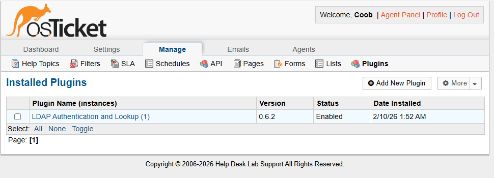
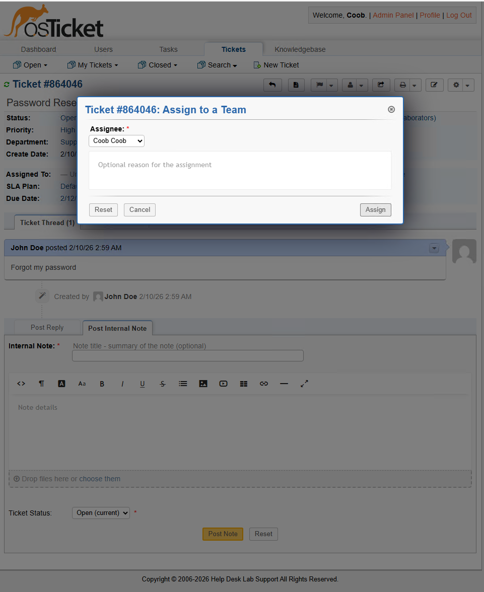
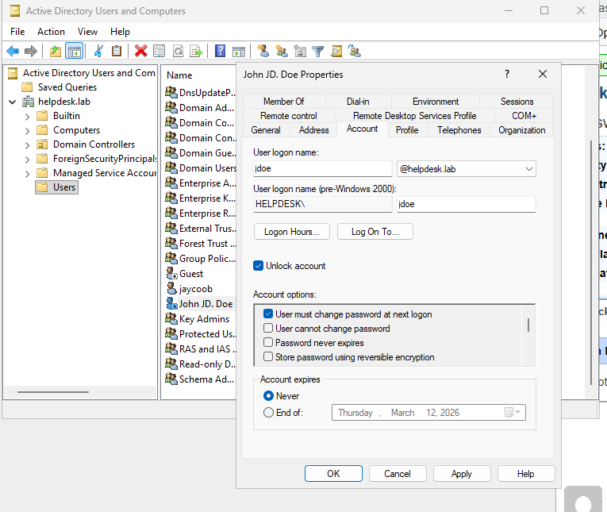
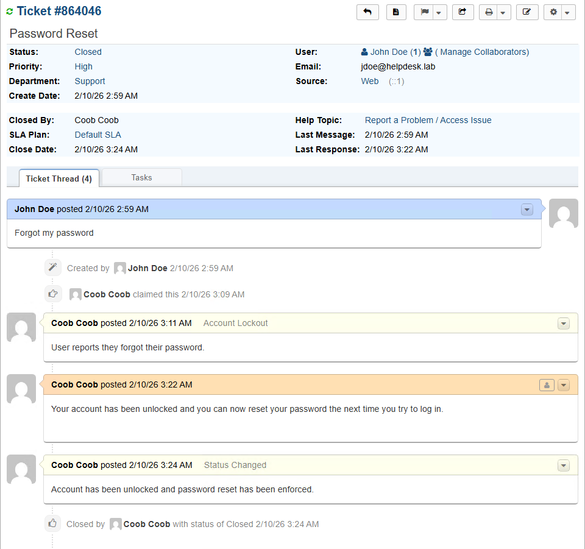

# Help Desk Ticketing System & Identity Management Lab

### Role: Help Desk Administrator | Identity and Access Management Analyst
### Environment/Tools: Microsoft Azure, Windows Server 2022, Internet Information Services (IIS), MySQL, osTicket

---

## Overview

This project demonstrates the full deployment of a Microsoft Azure Windows Virtual Machine and the deployment of a centralized ticketing system integrated with **Active Directory (AD)** via **LDAP**. Showcases the complete lifecycle of a user identity, from provisioning and security hardening to incident remediation. In this specific project it was to demonstrate a account lockout and how to remediate it(password reset) from a IAM/Help desk perspective.

---

## Phase 1: Infrastructure & Provisioning

In this phase, I deployed a Windows Server 2022 instance in Azure and configured the web environment.

- Identity Infrastructure: Deployed and promoted a Windows Server VM (`VM01`) to a Domain Controller, thus establishing the Active Directory forest (`helpdesk.lab`) and configured core Directory Services.
- Web & Database Tier: Provisioned a MySQL database(`osticket_db`) to store tickets and downloaded and optimized the IIS/PHP environment for application hosting.
    - Screenshot: 

- Application Deployment: Successfully installed osTicket.
    - Screenshot: 
 
## Phase 2: Security Hardening & Access Control

Followed the Principle of Least Privilege and secured the systems sensitive data.

- New File Technology System(NTFS) Permission Configuration: Modified Access Control Lists (ACLs) to set the `ost-config.php` file to 'Read-Only' after osTicket was installed so their won't be risks of unauthorized configuration changes.
    - Screenshot: 

## Phase 3: Identity Federation (Integrated LDAP)

To centralize authentication, I established a 'handshake' between the web application and the Domain Controller.

- LDAP Configuration: Implemented a Bind DN(Distinguished Name) using a dedicated service account to allow osTicket to query the helpdesk.lab directory.
- Federation Successfully Enabled: LDAP plugin was active and successfully commujnicated with the Domain Controller.
    - Screenshot: 
 
## Phase 4: Incident Response & Account Remediation

This phase, I simulated a common Identity and Access Management lifecycle/help desk event: a account lockout that happened due to failed authentication attempts. (Forgetting password and getting locked out)

- Documentation: Utilized the staff panel to assign the ticket to the appropriate personel, and added internal audit notes.
    - Screenshots:         
 
- Resolution of Ticket: Resolved the account lockout within Active Directory and set a forced password change at next logon, ensuring that user would be able to recover account.
    - Screenshot: 
 
- Closure & Verification: Communicated the resolution of the ticket to the user and formally closed the incident.
    - Screenshots:     
 
---

## Takeaways

Doing this lab from the setup to the resolution of the ticket was a good experience. The experience of setting up the entire environment to working in osTicket and Active Directory to resolve a ticket helped simulate a little portion of the day to days of a IAM/Help desk professional.

