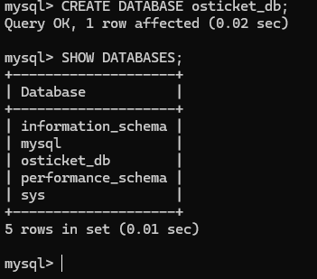
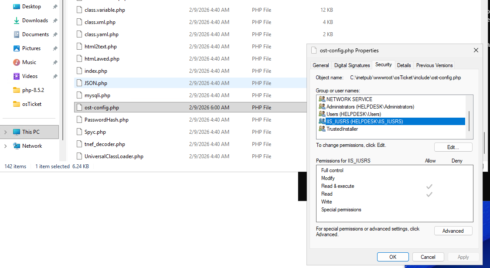

# Help Desk Ticketing System & Identity Management Lab

### Role: Help Desk Administrator | Identity and Access Management Analyst
### Environment/Tools: Microsoft Azure, Windows Server 2022, Internet Information Services (IIS), MySQL, osTicket

---

## Overview

This project demonstrates the full deployment of a Microsoft Azure Windows Virtual Machine and the deployment of a centralized ticketing system integrated with **Active Directory (AD)** via **LDAP**. Showcases the complete lifecycle of a user identity, from provisioning and security hardening to incident remediation. In this specific project it was to demonstrate a account lockout and how to remediate it(password reset) from a IAM/Help desk perspective.

---

## Phase 1: Infrastructure & Provisioning

In this phase, I deployed a Windows Server 2022 instance in Azure and configured the web environment.

- Identity Infrastructure: Deployed and promoted a Windows Server VM to a Domain Controller, thus establishing the Active Directory forest (`helpdesk.lab`) and configured core Directory Services.
- Web & Database Tier: Provisioned a MySQL database(`osticket_db`) to store tickets and downloaded and optimized the IIS/PHP environment for application hosting.
    - Screenshot: 

- Application Deployment: Successfully installed osTicket.
    - Screenshot: 
 
## Phase 2: Security Hardening & Access Control

Followed the Principle of Least Privilege and secured the systems sensitive data.

- New File Technology System(NTFS) Permission Configuration: Modified Access Control Lists (ACLs) to set the `ost-config.php` file to 'Read-Only' after osTicket was installed so their won't be risks of unauthorized configuration changes.
    - Screenshot:  
